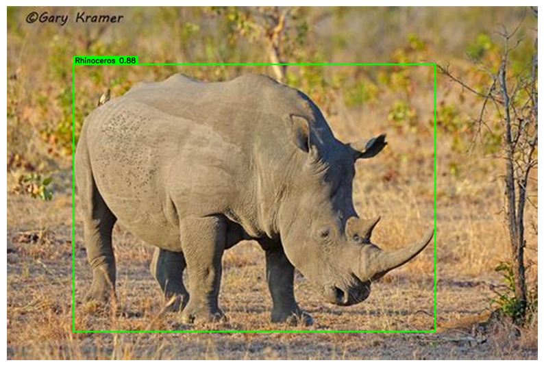
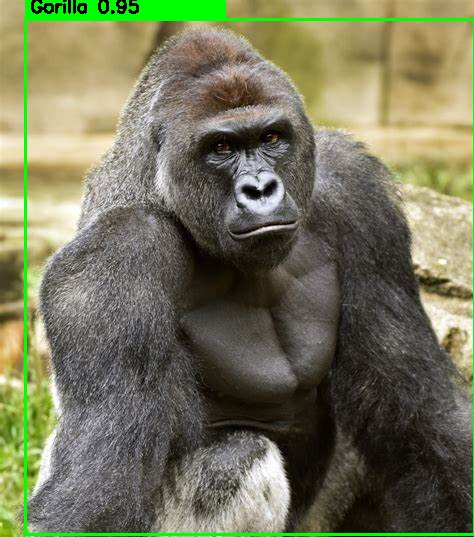

# Animal Detection using YOLOv8


A **Deep Learning based Animal Detection System** built using **YOLOv8, PyTorch, and Roboflow**.
This project trains a custom object detection model to detect animals in images and display **bounding boxes with confidence scores**.

---

# Open in Google Colab

Run the notebook directly in **Google Colab** to avoid dependency issues.

[](https://colab.research.google.com/drive/1GMFZwjVozt6AIffmmEz7l0lkmS1u36TK?usp=sharing)

⚠ **Important:** Run this notebook using **Google Colab with T4 GPU** for faster training and smooth execution.

---

# Project Overview

This project implements an **Animal Detection System** using **YOLOv8**, a state-of-the-art real-time object detection algorithm.

The system performs:

* Detect animals in images
* Draw bounding boxes around detected animals
* Show prediction confidence scores
* Evaluate model performance using mAP metrics
* Run inference on custom test images

The dataset is prepared using **Roboflow** and trained using the **Ultralytics YOLOv8 framework**.

---

# Supported Animal Classes

The model is trained to detect the following **five wildlife species**:

| Class ID | Animal     |
| -------- | ---------- |
| 0        | Gorilla    |
| 1        | Lion       |
| 2        | Elephant   |
| 3        | Rhinoceros |
| 4        | Tiger      |

⚠ The trained YOLOv8 model **can detect only these animals**.
Images containing other animals may **not be detected correctly** because they were not included in the training dataset.

This makes the model suitable for **wildlife monitoring and conservation research focused on these species**.


# Tech Stack

| Technology   | Purpose                    |
| ------------ | -------------------------- |
| Python       | Programming Language       |
| YOLOv8       | Object Detection Model     |
| PyTorch      | Deep Learning Framework    |
| Roboflow     | Dataset Preparation        |
| OpenCV       | Image Processing           |
| Matplotlib   | Visualization              |
| Google Colab | Model Training Environment |

---

# Model Training

Model used: **YOLOv8 Nano (yolov8n)**

Training configuration:

| Parameter  | Value              |
| ---------- | ------------------ |
| Epochs     | 25                 |
| Image Size | 640                |
| Batch Size | 16                 |
| Framework  | Ultralytics YOLOv8 |

Training is performed using the **Ultralytics YOLO library** in Google Colab.

---

# Model Performance

Example evaluation results:

```
mAP50: 0.82
mAP50-95: 0.61
```

Evaluation metrics used:

* **mAP50** – Mean Average Precision at IoU 0.50
* **mAP50-95** – Average precision across multiple IoU thresholds

These metrics indicate the **accuracy of the object detection model**.

---

# Detection Results

Example outputs from the trained YOLOv8 model.





Each detection contains:

* Animal class label
* Bounding box
* Confidence score

---

# ▶️ Running the Project

## 1️⃣ Open in Google Colab

Click the **Open in Colab** button above.

---

# Run with GPU (Recommended)

For best performance, run this notebook in **Google Colab with a T4 GPU**.

### Enable GPU in Colab

1. Open the notebook in **Google Colab**
2. Click **Runtime → Change runtime type**
3. Select:

```
Hardware accelerator: GPU
```

4. Click **Save**

Verify GPU availability:

```
import torch
print(torch.cuda.is_available())
```

If GPU is enabled, the output will be:

```
True
```

---

# Why use T4 GPU?

Using **T4 GPU** greatly improves YOLOv8 training performance.

| Benefit                   | Explanation                                                              |
| ------------------------- | ------------------------------------------------------------------------ |
| ⚡ Faster Training         | GPU parallel processing trains deep learning models much faster than CPU |
| 🧠 AI Optimized Hardware  | T4 GPU is designed for deep learning workloads                           |
| ⏱ Reduced Training Time   | Training time decreases significantly                                    |
| 📦 Handles Large Images   | Efficient processing of 640×640 images                                   |
| 🚀 Faster Experimentation | Allows testing multiple training configurations quickly                  |

Running on CPU may cause **very slow training and possible timeouts**, therefore GPU is recommended.

---

## 2️⃣ Install Dependencies

The notebook installs required libraries automatically:

```
pip install roboflow
pip install ultralytics opencv-python matplotlib
```

---

## 3️⃣ Upload Test Images

Upload test images to Google Drive:

```
/content/drive/MyDrive/sample_test_images
```


## 4️⃣ Update Test Image Path

Make sure the notebook uses the correct path:

```
test_images_folder = "/content/drive/MyDrive/sample_test_images"
```

---

# Dataset

The dataset is created and managed using **Roboflow**.

Dataset preparation steps:

* Image collection
* Annotation
* Data preprocessing
* Export in **YOLOv8 format**

---

# Future Improvements

Possible enhancements for the project:

*  Real-time **webcam animal detection**
*  **Wildlife monitoring system**
*  Integration with **object tracking algorithms**
*  Edge deployment using **Raspberry Pi**
*  Mobile or web-based detection application

---
